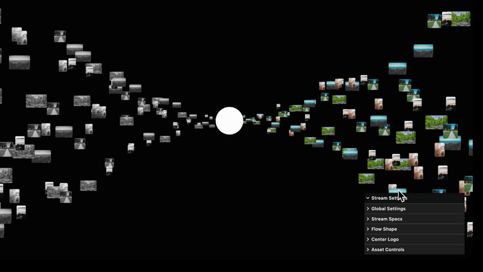

  
  
  <h1 align="center">IMAGE STREAM</h1>
  <h3 align="center"> Interactive WebGL Image Particle Stream </h3>

  <!-- TOP PURPLE LINKS -->
  
  
  
   
  <!-- BOTTOM GOLD TAXONOMY -->
  
  
  
  

  

  

    <i> An interactive WebGL particle stream viewer rendering instanced image streams curving around a deformed path. </i>
  

  

Welcome to **Image Stream**, a high-performance WebGL-based visualization component designed for Obsidian using Datacore. It streams hundreds of images in real-time utilizing instanced particle shaders, allowing you to manipulate flow geometry and map bulk-uploaded assets seamlessly.

---

## ✨ Features

### 🌪️ Instanced WebGL Streaming
*   🚀 **Performance First**: Streams hundreds of image textures concurrently with minimal GPU load using `THREE.InstancedMesh`.
*   🧬 **Deformation Math**: Trajectories are bent dynamically through customizable curve powers and center squashing.

### 🎨 Fully Adaptive Theme Control
*   🌓 **Host-Native Theme Adaptability**: Automatically matches Obsidian colors, responding dynamically to dark and light modes.
*   🎛️ **Settings Panel**: Built-in floating configuration panel allows tweaking particle counts, speed, scale, margins, and center logo sizes.

---

## 📦 Directory Index & Components

The package exposes the following compiled files:

| File | Description |
| :--- | :--- |
| **[`IMAGE STREAM.md`](IMAGE%20STREAM.md)** | The main entry point leaf designed to be loaded inside Obsidian panes. |
| **[`src/index.jsx`](src/index.jsx)** | Main bootstrap application loader and polling invalidation daemon. |
| **[`src/App.jsx`](src/App.jsx)** | The view coordinator loading dependency modules. |
| **[`src/components/StreamComponent.jsx`](src/components/StreamComponent.jsx)** | The core WebGL stream component using Three.js and Lil-gui. |
| **[`src/styles/styles.jsx`](src/styles/styles.jsx)** | Helper styling sheet mapped to Obsidian native CSS variables. |
| **[`src/utils/domUtils.jsx`](src/utils/domUtils.jsx)** | DOM helper utilities. |
| **[`data/mcp_commands.json`](data/mcp_commands.json)** | Local polling payload for HMR invalidation. |
| **[`METADATA.md`](METADATA.md)** | Packaging manifest outlining indexing, target, and security configurations. |
| **[`CONTRIBUTION.md`](CONTRIBUTION.md)** | Contributor architecture standards. |
| **[`LICENSE.md`](LICENSE.md)** | MIT open-source license. |
